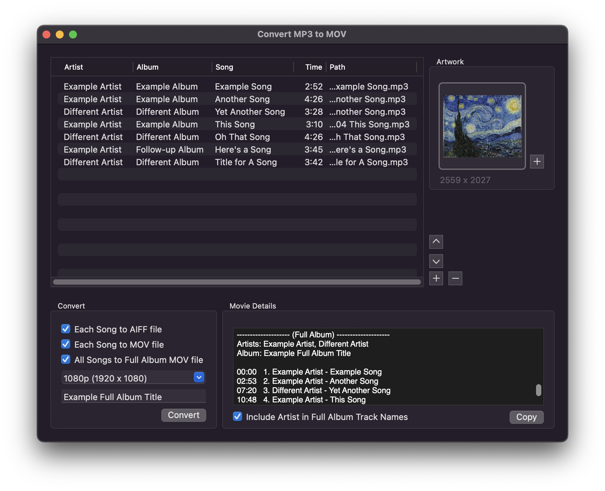

# Convert MP3 To MOV

A macOS app that converts MP3 audio into MOV video art tracks. The generated video plays the selected audio while showing a selected artwork image.

This helps easily create individual art tracks, as well as full album art tracks, that can be uploaded to YouTube.

## Features

- Convert a single MP3 to MOV
- Convert a group of MP3 files into one Full Album MOV
- Convert a single MP3 to AIFF
- Choose artwork
- Choose video size
- Convenient movie details

## Screenshot

---

## Table of Contents

- [Run App](#run-app)
- [Copyright](#copyright)
- [License](#license)

---

## Run App

1. Download and open project in Xcode.

2. Build and Run.

---

## Copyright

Copyright (c) 2022 X28 Project

---

## License

[MIT](LICENSE)
